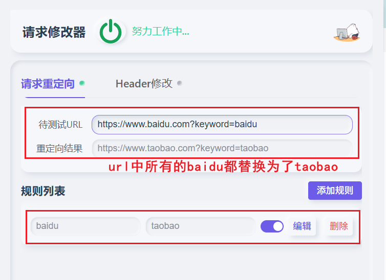
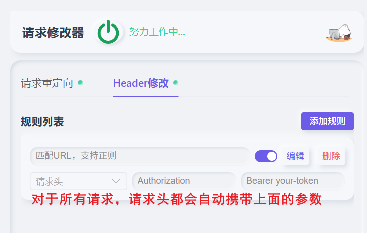

# 请求修改器 - 使用说明

## 简介

请求修改器是一款浏览器扩展工具，支持 Chrome 和 Edge，可以帮助开发者在开发调试过程中灵活地修改浏览器发出的请求，包括请求重定向和请求头修改。

所有规则数据通过浏览器扩展的同步存储（chrome.storage.sync）保存，同一账号下多设备自动同步。

## 请求重定向

将匹配到的 URL 请求重定向到指定的目标地址，常用于开发环境地址、端口切换等场景。

### 使用方法

其实就是很简单的URL地址查找替换。

- **匹配值**：输入要匹配的字符串，支持正则表达式。
- **替换值**：输入要替换的字符串，支持正则替换语法。留空则将匹配内容替换为空串
- **启用/禁用**：通过开关控制单条规则是否生效
- **编辑**：点击"编辑"按钮进入编辑模式，修改后点击"保存"
- **删除**：点击"删除"按钮移除规则

### 示例

将所有 `https://www.baidu.com` 的请求重定向到 `https://www.taobao.com`：

| 字段   | 值       |
| ------ | -------- |
| 匹配值 | `baidu`  |
| 替换值 | `taobao` |

这样，只要在浏览器请求的地址包含`baidu`，都将其替换为`taobao`

如下图所示：

### URL 测试

在规则列表上方的测试区域输入待测试的 URL，可以实时预览URL重定向结果，方便验证规则是否正确。

## 请求头修改

对匹配到的请求添加、修改或删除请求头，常用于模拟特定请求头、注入认证信息等场景。

### 使用方法

- **匹配URL**：输入要匹配的 URL 字符串，只要URL包含则匹配，支持正则表达式。留空表示对所有请求生效
- **请求头名称**：输入要操作的请求头参数名称，如 `Authorization`
- **请求头值**：要设置的请求头参数的值
- **启用/禁用**：通过开关控制单条规则是否生效
- **编辑规则**：点击"编辑"按钮进入编辑模式，修改后点击"保存"
- **删除规则**：点击"删除"按钮移除规则（需二次确认）

### 示例

为所有请求添加 `Authorization` 头：

| 字段         | 值                    |
|--------------|-----------------------|
| 匹配URL      | 留空                  |
| Header 名称  | `Authorization`       |
| Header 值    | `Bearer your-token`   |

配置如下图所示：

## 限制说明

> **响应头修改暂不支持**
>
> 由于 Chrome Manifest V3 的 `declarativeNetRequest` API 限制，当前版本暂不支持响应头修改功能。后续如 Chrome 放开限制将及时支持。

### 禁止修改的请求头

浏览器出于安全考虑，以下请求头无法通过扩展修改：

| 请求头                              | 说明                             |
|-------------------------------------|----------------------------------|
| `Host`                              | HTTP 协议核心头，由浏览器自动设置 |
| `Origin`                            | 防止 CSRF 攻击，浏览器禁止伪造   |
| `Referer`                           | 受浏览器 Referrer-Policy 控制    |
| `Cookie`                            | 受 SameSite 等安全策略限制       |
| `Connection`                        | 连接管理头，由浏览器控制         |
| `Keep-Alive`                        | 持久连接头，由浏览器控制         |
| `Accept-Charset`                    | 已废弃，浏览器不再支持修改       |
| `Accept-Encoding`                   | 编码协商头，由浏览器控制         |
| `Access-Control-Request-Headers`    | CORS 预检头，由浏览器自动设置    |
| `Access-Control-Request-Method`     | CORS 预检头，由浏览器自动设置    |
| 以 `Sec-` 开头的头                  | 安全相关头，浏览器禁止修改       |
| 以 `Proxy-` 开头的头                | 代理相关头，浏览器禁止修改       |

如需修改以上请求头，建议使用本地代理工具（如 Fiddler、Charles、mitmproxy）。

## 注意事项

- 匹配值使用正则表达式语法，特殊字符需要转义
- 替换值支持正则替换语法，如 `$1`、`$2` 引用捕获组；留空则将匹配内容替换为空串
- 插件禁用后所有规则将停止生效，重新启用后自动恢复
- 请求头修改规则中，匹配URL留空表示匹配所有请求，请谨慎使用
- 规则数据通过 `chrome.storage.sync` 保存，同一账号下多设备自动同步
